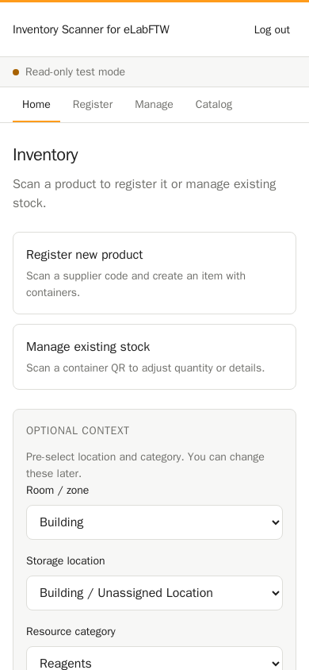
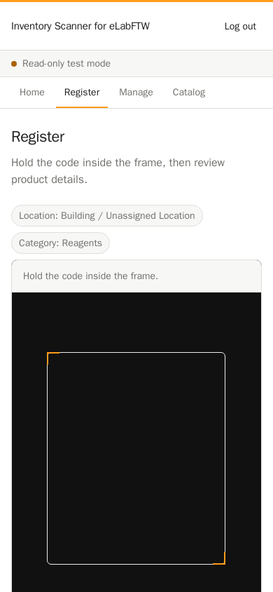
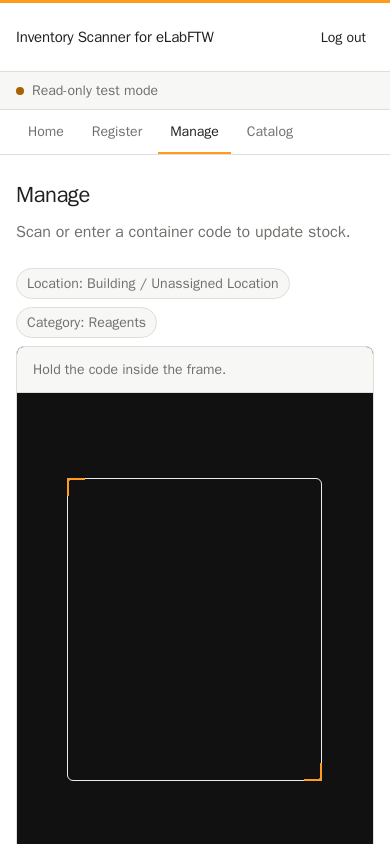
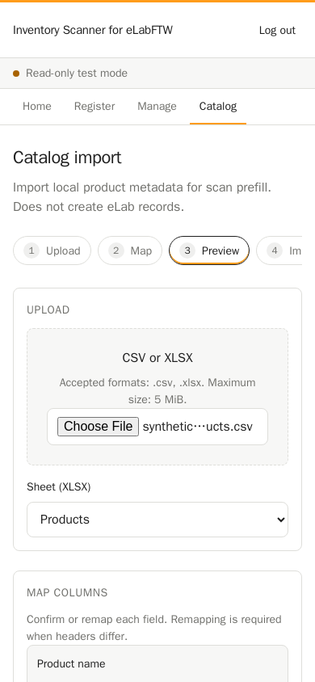
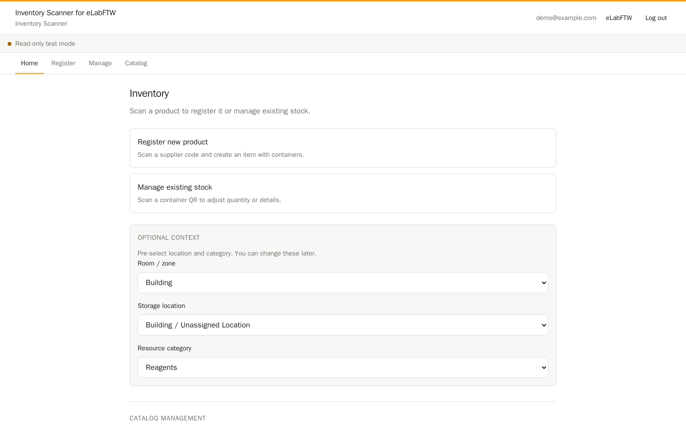
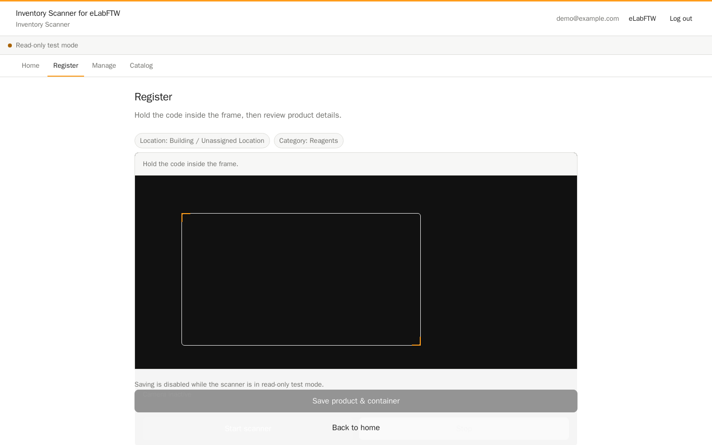
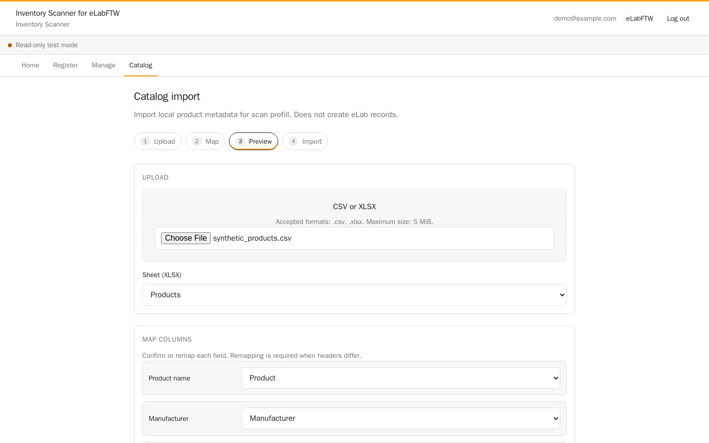

# Inventory Scanner for eLabFTW

Mobile-first inventory companion for **eLabFTW 5.5.x**.

This project is an independent FastAPI BFF + web UI that talks to eLabFTW over its public API. It is **not** part of eLabFTW, **not** affiliated with Deltablot, and **not** a validated GxP system.

## What it does

Two operator workflows:

1. **Register new product** — scan or enter a manufacturer code, confirm identity fields, then create eLabFTW Item + Container(s) (when live writes are enabled).
2. **Manage existing stock** — scan an internal container QR / ID and update quantity (consume, restock, set exact, mark empty).

Supporting features:

- Camera barcode detection (native `BarcodeDetector` with ZXing fallback)
- Local SQLite product catalog for scan prefill (CSV/XLSX import)
- Authentik / OIDC session gate (optional)
- Write gate `ELAB_INTEGRATION_LIVE` (default **false**)
- Reverse-proxy friendly under Caddy path prefix `/scanner`

## Screenshots

Demo UI with synthetic catalog data only (`VendorA`–`VendorD` / Example Chemical A–D). Writes disabled (`ELAB_INTEGRATION_LIVE=false`).

### Mobile









### Desktop

<details>
<summary>Desktop layouts (1440×900)</summary>

| Home | Register |
| --- | --- |
|  |  |

| Manage | Catalog import |
| --- | --- |
|  |  |

</details>

## Quick start (Docker)

```bash
cp .env.example .env
# Fill ELABFTW_API_URL / ELABFTW_API_KEY and session secrets.
# Keep ELAB_INTEGRATION_LIVE=false until you intentionally enable writes.

docker compose up -d --build
```

Health (behind Caddy `/scanner` stripping):

```bash
curl -fsS https://elab.example.com/scanner/health
```

### Caddy prefix (example)

```caddyfile
handle_path /scanner/* {
    reverse_proxy inventory-scanner:8020
}
```

### OIDC (optional)

Set `OIDC_ISSUER`, `OIDC_CLIENT_ID`, `OIDC_CLIENT_SECRET`, and `SCANNER_SESSION_SECRET`.
Redirect URI: `https://elab.example.com/scanner/auth/callback`.

When OIDC is configured, unauthenticated browser visits redirect to login and APIs return `401` JSON.

## Development

```bash
python3 -m venv .venv
.venv/bin/pip install -e ".[dev]"
.venv/bin/pytest

# Web bundle (required for UI-serving tests)
bash scripts/build_web.sh
```

## Write safety

- `ELAB_INTEGRATION_LIVE=false` → mutation endpoints return **403**
- Local catalog import/save does **not** create eLabFTW inventory records
- Browser never receives the eLabFTW API key

## License

Apache License 2.0. See `LICENSE` and `NOTICE`.

## Disclaimer

This software is provided **as is**, without warranty. It has **not** been validated for GMP, GDP, GxP, or 21 CFR Part 11 use. You are responsible for your own risk assessment, configuration, and deployment practices. eLabFTW® is a trademark of its respective owners; this project is an independent API client.
